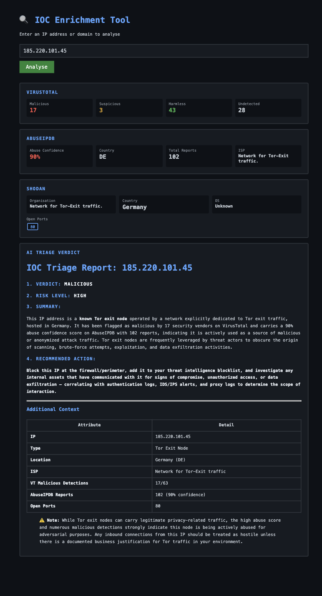

# IOC Enrichment Tool

A web-based threat intelligence tool that automatically enriches Indicators of Compromise (IPs and domains) using multiple security APIs and generates an AI-powered triage report.

Built as a practical SOC analyst tool to automate the manual process of cross-referencing multiple threat intelligence platforms.

## Demo



## Features

- **VirusTotal** — vendor detection counts across 90+ antivirus engines
- **AbuseIPDB** — community abuse reports, confidence score, ISP and geolocation
- **AI Triage Verdict** — Claude AI synthesises all data into a structured analyst report including verdict, risk level, summary, and recommended action

## Tech Stack

- Python / Flask
- VirusTotal API
- AbuseIPDB API
- Anthropic Claude API
- Vanilla JS frontend

## Setup

1. Clone the repo
```bash
git clone https://github.com/TommyFischer/ioc-enrichment-tool.git
cd ioc-enrichment-tool
```

2. Install dependencies
```bash
pip3 install flask anthropic requests python-dotenv
```

3. Create a `.env` file with your API keys
VIRUSTOTAL_API_KEY=your_key_here
ABUSEIPDB_API_KEY=your_key_here
ANTHROPIC_API_KEY=your_key_here

4. Run the app
```bash
python3 app.py
```

5. Open `http://localhost:8080` in your browser

## Usage

Enter any IP address into the search box and click Analyse. The tool will query all APIs in parallel and return a formatted triage report within a few seconds.

## Example Output

For a known malicious Tor exit node (`185.220.101.45`):
- **Verdict:** Malicious
- **Risk Level:** High
- 17 malicious detections on VirusTotal
- 92% abuse confidence score, 102 community reports on AbuseIPDB
- AI recommended action: block at firewall/perimeter and correlate with SIEM logs
